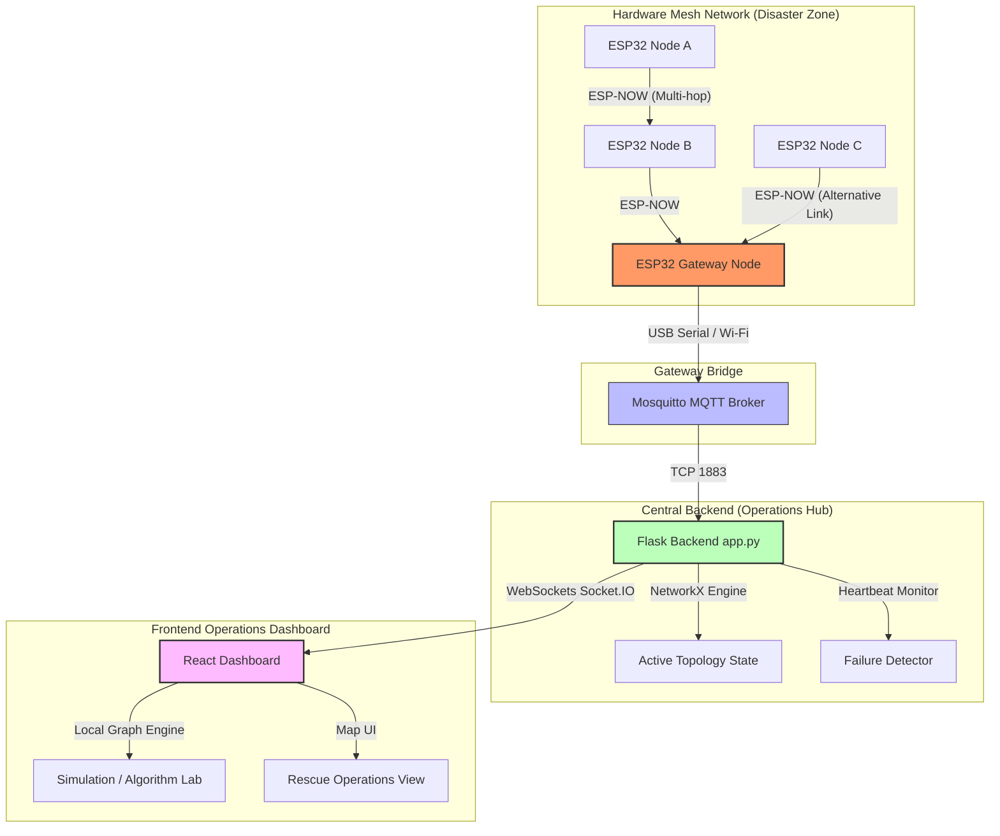

# ResQMesh: Intelligent Self-Healing Disaster Communication & Rescue Routing System

ResQMesh is an ad-hoc, infrastructure-less disaster response communication platform. By integrating ESP32-based hardware mesh networking (via ESP-NOW), IoT environmental sensors, real-time command visualization, and advanced graph pathfinding algorithms, it delivers resilient peer-to-peer data transmission and optimized rescue routing in environments where conventional cellular networks or internet backhauls have failed.

---

## 1. Problem Statement

In severe natural and human-induced disasters—such as earthquakes, flash floods, landslides, and building collapses—traditional communication infrastructure (cellular towers, fiber optic cables, power grids, and internet service providers) is typically damaged or overloaded. 

### The Challenges
* **Information Blackout:** Displaced populations and emergency victims cannot contact rescue services, reporting their coordinates or medical status.
* **Telemetry Deficit:** First responders lack critical localized telemetry, such as toxicity level changes (gas leaks), heat/humidity spikes, and structural battery states.
* **Inefficient Rescue Paths:** Without a live map of functional routes and physical obstacles, rescue vehicles waste valuable time traversing congested or destroyed pathways.
* **Resource Constraints:** Existing mesh solutions often fail due to packet collisions, loop creation, and high power usage. They lack the intelligence to prioritize life-saving SOS alerts over periodic environmental status reports.

---

## 2. Project Objectives

The primary objective of ResQMesh is to design, implement, and validate a highly resilient, self-forming, and self-healing communications mesh that delivers live safety updates from disaster-stricken zones back to a central command station.

### Specific Technical Objectives:
1. **Develop an Ad-Hoc Physical Layer Mesh:** Utilize low-cost ESP32 microcontrollers communicating via Espressif’s connectionless **ESP-NOW** protocol to form a wireless mesh spanning multiple hops without requiring external routers.
2. **Implement Dynamic Routing with Self-Healing:** Program a custom Distance Vector (DV) routing mechanism based on the Bellman-Ford algorithm that adjusts to node additions and automatically bypasses hardware failures (e.g., destroyed nodes) in real time.
3. **Integrate Real-Time IoT Telemetry:** Equip mesh nodes with DHT22 (temperature/humidity) and MQ-2 (gas/smoke) sensors alongside LiPo battery monitors to automatically gauge danger levels in localized grid zones.
4. **Deploy Quality of Service (QoS) Queueing:** Incorporate strict-priority ring buffers directly in firmware to guarantee that critical payload frames (such as manual SOS alerts) are transmitted first, preempting regular sensor updates and network diagnostic logs.
5. **Build a Central Operations Dashboard:** Construct a visual React dashboard linked to a Python Flask backend over MQTT and WebSockets. This system visualizes live network topography, tracks packet-level transmissions, and maps real-time sensor updates.
6. **Provide Interactive Rescue Pathfinding:** Embed an advanced Graph Engine supporting path calculations (Dijkstra, BFS, DFS, Prim's Minimum Spanning Tree, and Traveling Salesman Problem) to optimize routing for rescue teams navigating through the live mesh nodes.

---

## 3. System Architecture

The following diagram illustrates how telemetry moves from remote, multi-hop mesh nodes, through the hardware gateway, and into the command center interface:



---

## 4. Methodology Followed

The implementation follows a modular, cross-stack methodology:

### A. Firmware Engineering (ESP32 Nodes)
To conserve memory and ensure high performance, the firmware is written in C++ and organized into five single-header components:
1. **`config.h`:** Manages node identity (`NODE_ID`, `NODE_LABEL`), operational roles (mesh node vs. gateway), sensor pinouts, and timeouts.
2. **`mesh_types.h`:** Defines the `MeshFrame` wire packet format (226-byte packed structure) which includes packet type, source ID, destination ID, MAC address, RSSI, TTL, sequence number, and JSON payload.
3. **`discovery.h`:** Manages neighbor tables. Nodes broadcast `HELLO` frames periodically; neighbors respond with `HELLO_ACK`. The link quality is evaluated using an **Exponential Moving Average (EMA)** of RSSI: 
   $$\text{Link Cost} = \max(1, 110 + \text{RSSI})$$
4. **`routing.h`:** Implements **Bellman-Ford Distance Vector (DV) Routing**. Each node stores the shortest path and next-hop for every known destination in the mesh.
5. **`forwarding.h`:** Handles frame relaying. It uses a **32-slot circular seen-set cache** to prevent processing duplicate packets, decrements TTL to prevent infinite routing loops, and forwards packets toward their next-hop destination.
6. **`qos_queue.h`:** Runs four strict-priority ring buffers (`HIGH`, `MEDIUM`, `LOW`, `DEBUG`). The main microcontroller loop allocates a specific time budget (default $8\text{ ms}$) to drain packets starting from the highest priority.

> [!NOTE]
> **Poison-Reverse Mechanism:** 
> If a neighbor is silent for more than $15\text{ seconds}$, it is evicted. The local node immediately poisons all routes traversing that neighbor (setting hop count to infinity) and initiates a triggered routing table update broadcast to prevent routing loops.

### B. Gateway & Backend Integration
* **MQTT Pub/Sub:** The gateway node connects to a Wi-Fi Access Point and bridges ESP-NOW packet frames onto a local Mosquitto MQTT broker on topics patterned as `resqmesh/{node_id}/{type}`.
* **NetworkX Graphs:** The Python Flask backend subscribes to the MQTT feed. It keeps an dynamic network graph in-memory using `NetworkX`. 
* **Heartbeat & Failure Checking:** The backend tracks the timestamps of incoming frames. If a node fails to report within $6\text{ seconds}$, it triggers a network failure event, pushing the updated network graph state out to all connected browser clients.

### C. Frontend Dashboard & Pathfinding
* **Dual-Mode Operation:**
  1. **Hardware Mode:** Hooks directly into the Flask Socket.IO stream to display live topology, actual packet feeds, and hardware sensor readings.
  2. **Simulation Mode:** Decouples from the physical network and uses the local javascript `simulation.js` engine to simulate node additions, failures, packet travel, and path calculations right in the browser.
* **Algorithm Suite:** Integrates step-by-step visualizations of common pathfinding algorithms to help responders identify bottlenecks, construct emergency wiring paths, and sequence multiple rescue stops.

---

## 5. Detailed Features List

The capabilities of ResQMesh are divided across the network hardware, backend server, dashboard client, and algorithm simulation suite:

### 1. Mesh Networking & Routing Features
| Feature | Details & Mechanics |
| :--- | :--- |
| **Autonomic Discovery** | No pre-configuration of neighbors required. Nodes establish dynamic neighbor tables through periodic handshake broadcasts. |
| **Dynamic Path Metric** | Link costs are not hardcoded. They are calculated dynamically using the RSSI (signal strength) of received packets, ensuring that weak or unstable links are deprioritized. |
| **Self-Healing Reconvergence** | If an intermediate router goes offline, the mesh routes traffic around the failure. Bellman-Ford tables reconverge across the network within a single update cycle. |
| **Deduplication & Loop Guard** | Multi-hop packets are protected from infinite looping via sequence number caching and dynamic Time-To-Live (TTL) decrements. |
| **Priority-Aware QoS** | Critical packets like emergency alerts bypass standard queues and are transmitted instantly. Low-priority diagnostic frames wait until queues are clear. |

### 2. IoT Sensing & Telemetry Features
| Feature | Details & Mechanics |
| :--- | :--- |
| **Environmental Telemetry** | Real-time tracking of humidity levels and ambient temperatures (DHT22) to monitor localized flood or fire spread. |
| **Toxic Gas Detection** | Integrated MQ-2 analog reading tracks smoke, LPG, carbon monoxide, or methane concentrations, flagging dangerous zones for responders. |
| **Power Diagnostics** | Monitored battery voltage levels check the operational longevity of individual nodes in the field. |
| **Automated Alarm Triggers** | High-level gas or temperature readings automatically generate warning alerts, which are sent with `QOS_HIGH` prioritization. |

### 3. Command Center & Dashboard Features
| Feature | Details & Mechanics |
| :--- | :--- |
| **Live Topology Map** | An interactive canvas representing nodes as physical coordinates and links as colored edges (green for strong links, yellow for weak links, red for failed states). |
| **Telemetry History Graphs** | Responsive charts (using Chart.js) mapping historical changes in sensor data across individual selected nodes. |
| **Node Inspection Panel** | Inspects internal states of any mesh node, showing its active firmware configuration, sensor states, neighbor table, and Bellman-Ford routing table. |
| **Real-Time Alert Feed** | An operational stream displaying warning messages, node disconnect alerts, and emergency calls with timestamp logs. |
| **Simulation Sandbox** | Easily create new virtual nodes, toggle link connections, inject custom sensor values, and manually fail/recover nodes to run scenario drills. |

### 4. Rescue Mode & Algorithm Lab
| Feature | Details & Mechanics |
| :--- | :--- |
| **Dijkstra Shortest Path** | Calculates the absolute fastest routing path between the command center and a target node based on RSSI link cost. |
| **Breadth-First Search (BFS)** | Traverses the network level by level to find paths with the minimum hop count, prioritizing relay efficiency. |
| **Depth-First Search (DFS)** | Traverses deep paths down the network branches, helpful for discovering connectivity paths or checking loop properties. |
| **Prim's Algorithm (MST)** | Calculates the Minimum Spanning Tree of the active nodes. This shows the most cost-effective way to deploy relays or link all nodes together. |
| **TSP (Branch & Bound)** | Computes the optimal path for a rescue vehicle or drone to visit a series of disaster nodes (delivery/extraction points) and return home. |

---

## 6. Technical Stack

```
┌───────────────────────────────────────────────────────────────────────────┐
│                                FRONTEND                                   │
│ React (18)  •  TypeScript  •  Vite  •  Chart.js  •  Socket.IO Client      │
└─────────────────────────────────────┬─────────────────────────────────────┘
                                      │ WebSockets / REST API
┌─────────────────────────────────────▼─────────────────────────────────────┐
│                                BACKEND                                    │
│ Flask  •  Flask-SocketIO  •  Paho MQTT  •  NetworkX  •  SQLite / DB       │
└─────────────────────────────────────┬─────────────────────────────────────┘
                                      │ MQTT Protocol (TCP 1883)
┌─────────────────────────────────────▼─────────────────────────────────────┐
│                             GATEWAY / BROKER                              │
│ Mosquitto Broker  •  Gateway ESP32 Bridge                                 │
└─────────────────────────────────────┬─────────────────────────────────────┘
                                      │ ESP-NOW (2.4 GHz RF)
┌─────────────────────────────────────▼─────────────────────────────────────┐
│                              FIRMWARE NODES                               │
│ ESP32 MCUs  •  Arduino C++  •  DHT22 Temp/Humid  •  MQ-2 Gas  •  Battery   │
└───────────────────────────────────────────────────────────────────────────┘
```

---

## 7. Operational Workflow Demo

To test the system’s self-healing capabilities, run through the following demo:
1. **Network Initialization:** Power up three nodes (A, B, and Gateway). They will exchange `HELLO` packets, forming a linear network: `Node A <-> Node B <-> Gateway`.
2. **Pathfinding Validation:** View the dashboard. The routing graph will show that packets from Node A flow through Node B to reach the Gateway.
3. **Induced Node Failure:** Power down Node B.
4. **Automatic Re-Routing:** 
   * The Gateway and Node A detect Node B’s absence after $15\text{ seconds}$ of silence.
   * Node B is evicted from local tables, and routes crossing it are poisoned.
   * If Node A is moved within wireless range of the Gateway, they establish a direct link: `Node A <-> Gateway`.
   * Reconvergence completes in under a single DV update interval ($6\text{ seconds}$).
5. **Simulated Emergency Response:** Inject a high gas reading near Node A. It immediately issues an alert packet, bypassing regular sensor logs, appearing on the dashboard feed as a flashing alarm indicator.
6. **Rescue Dispatch calculation:** Click **Rescue Mode** on the dashboard, select target nodes, and run the **TSP solver** to calculate the absolute shortest path for first responders to visit all active alert sites.
